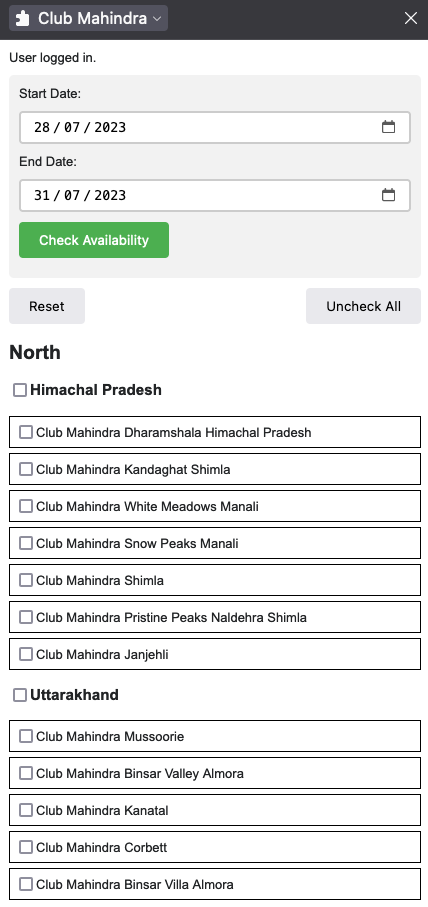
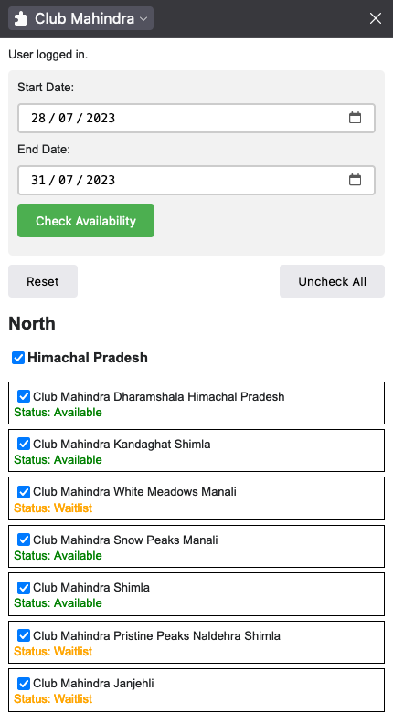

# Ease use of Club Mahindra

## Install and run
npm install

npm run start

extension will be in dist folder

## What it does

Gives the options of checking multiple resorts in one go

## What it shows

Shows the resort in a sidepanel grouped by state

